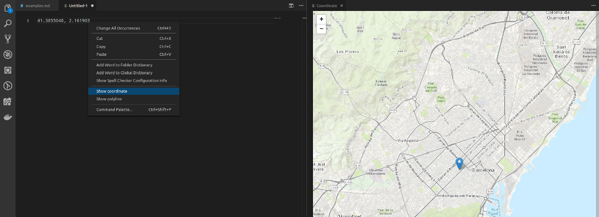

# Geo Tools

This extension provides with a series of convenient tools to deal with geographical data.

## Features

* **GPS Coordinates visualization**: Display the selected GPS coordinate on a map inside VS Code.
    * The numbers will be automatically extracted from your selection.

* **Polyline visualization**:  Display an encoded [polyline](https://developers.google.com/maps/documentation/utilities/polylinealgorithm) on map inside VS Code.
    * The entire text selection is parsed as a polyline.

## Requirements

If you have any requirements or dependencies, add a section describing those and how to install and configure them.

## Release Notes

### 1.1.0
- Parse coordinates among text
- Add coordinates shows all markers on a single map.
- Added popups to markers.
- Added coordinate and polyline values validation.
- Add multiple markers at once.
- Improve error management.

### 1.0.0
- Initial release of Geo Tools.

# Credits
Brought to you by the [SmartMonkey.io](https://smartmonkey.io) team.
